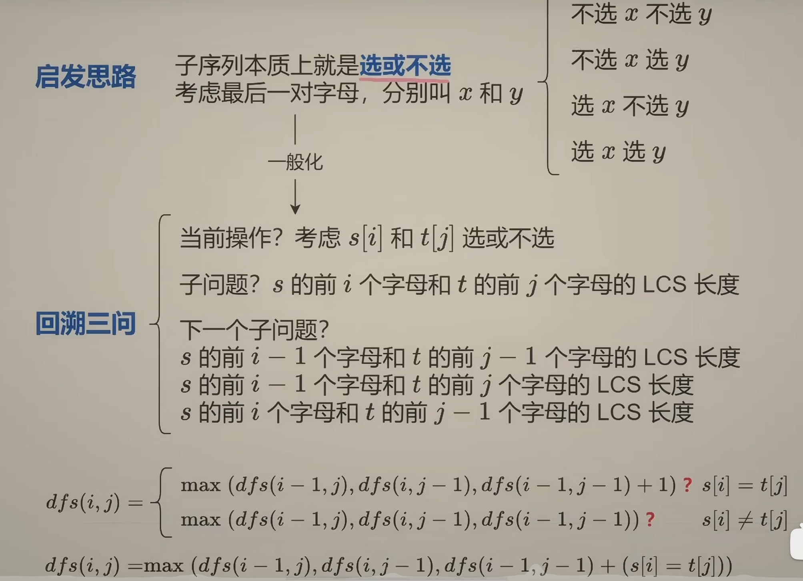
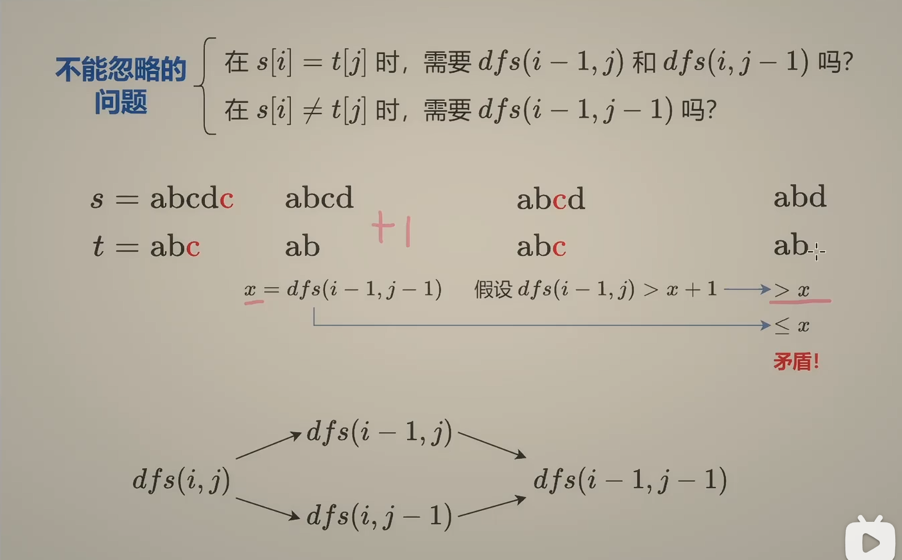
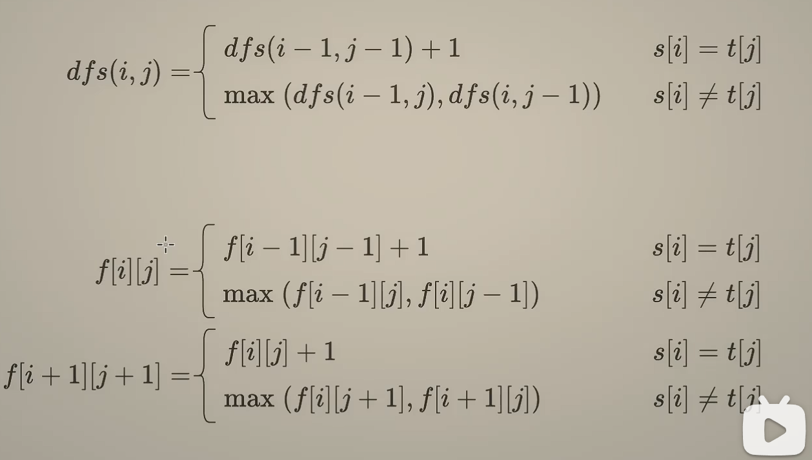

# 思路

# 注意

1. 从右往左递归，方便1:1翻译成从左往右的递推
2. i-1 表示不选 s[i]，j-1 表示不选 t[j]
3. 都选和都不选，他们的子问题是一样的。只有 s[i] = t[j] 的情况下才能都选，这种情况下都选肯定是比都不选要好的。
4. 将 +1 换成 s[i] = t[j]，就可以简化为一个式子

# 不能忽略的两个问题：

1. 在 s[i] = t[j] 时，需要考虑只选其中一个的情况吗
2. 在 s[i] != t[j] 时, 需要考虑都不选的情况吗

这是不需要的！

# 最终式

