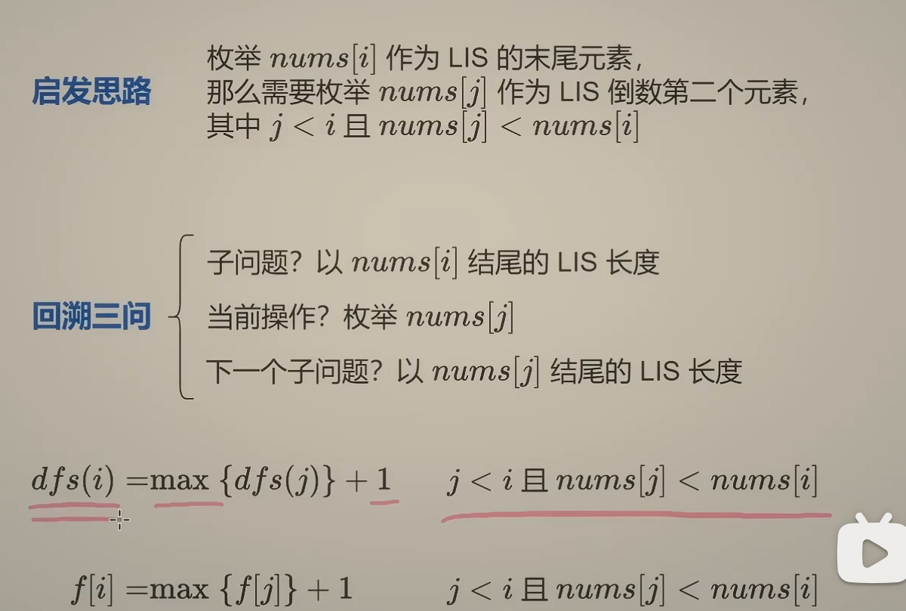

# 思考

- 由于子序列本身是数字的一个子集，所以用子集型回溯思考。
- 子集型回溯有两种思路
- 1.  选或不选：为了比大小，需要知道上一个选的数字 - 需要两个参数
- 2.  选哪个：比较当前选择数字和下一个要选的数字 - 只需要一个参数

# 注意

- dfs(i): 以 nums[i] 结尾的 LIS 长度
- 因为初始化数组为0的，但是单个元素对应的子序列长度为1，所以需要加一

# 变形

- 如果允许有相同元素，就把小于改成小于等于。

# LIS 与 LCS

1. 把数组 nums1 排序去重后 nums2，它的任意一个子序列必然是递增序子序列。
2. 把 nums1 和 nums2 求一个最长公共子序列，就可以得到 nums1 的最长递增子序列。

# 优化时间复杂度

对于动态规划问题，想要优化时间复杂度，有一个进阶技巧，就是交换状态与状态值（详见视频）
