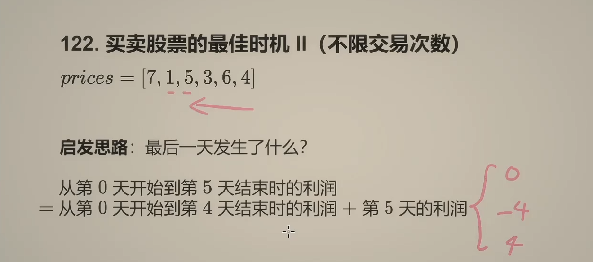
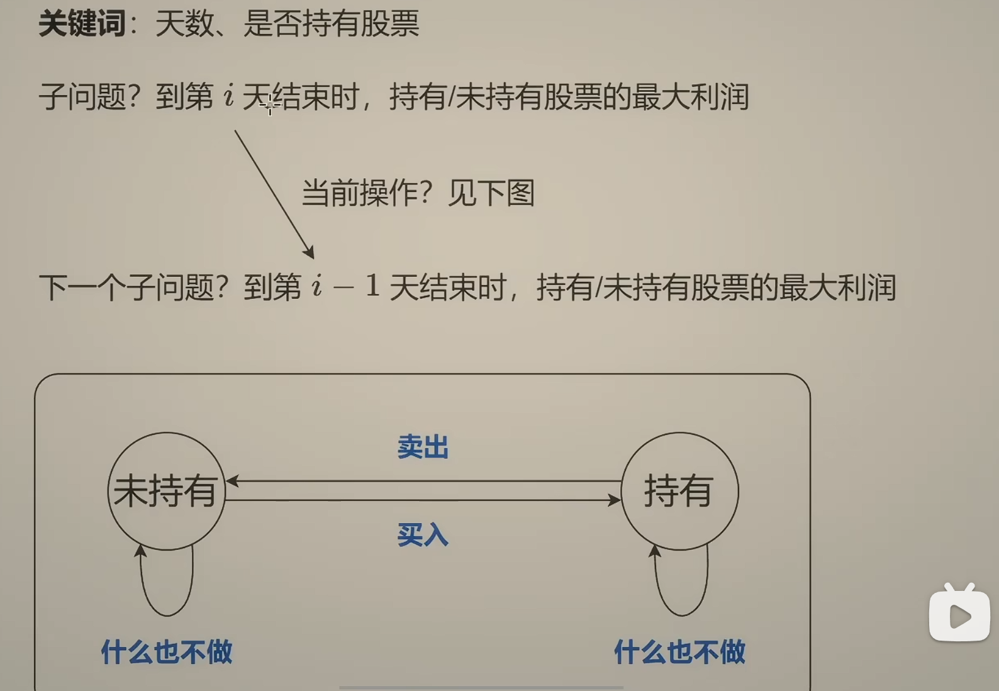
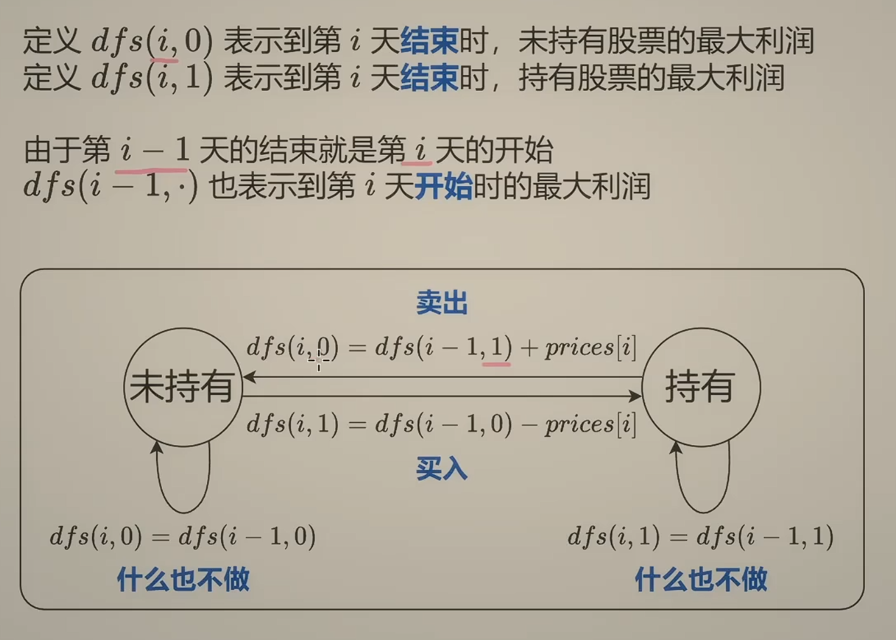
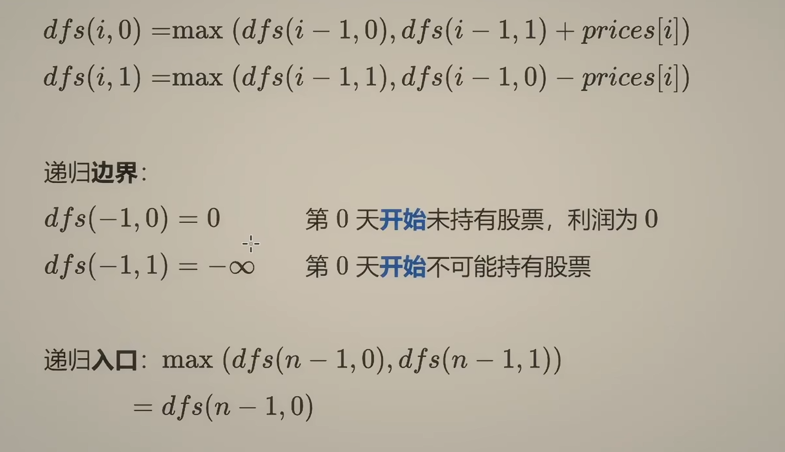

# 122 买卖股票的最佳时机 II(不限交易次数)

第 5 天的利润

- 什么都不做 - 0
- 买入股票 - -4
- 卖出股票 - 4 （不考虑前面买入时花了多少钱，归类到子问题 ）

以此不断地推

参数 i 表示考虑的是前 i 天的内容
参数 0/1 表示我们当前是否持有股票

状态转移的时候注意：只能持有一股股票

## 递归入口

`max(dfs(n-1,0),dfs(n-1,1)) = dfs(n-1,0)`

枚举最后一天是否还持有股票，但由于最后一天还持有股票，这个股票在后面就卖不出去了。
所以 dfs(n-1,1) 肯定是 <= dfs(n-1,0)
