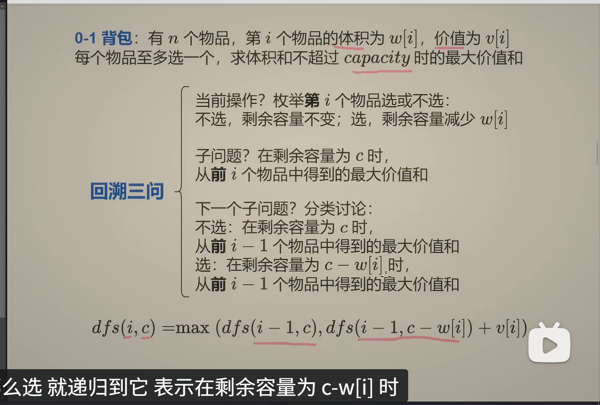
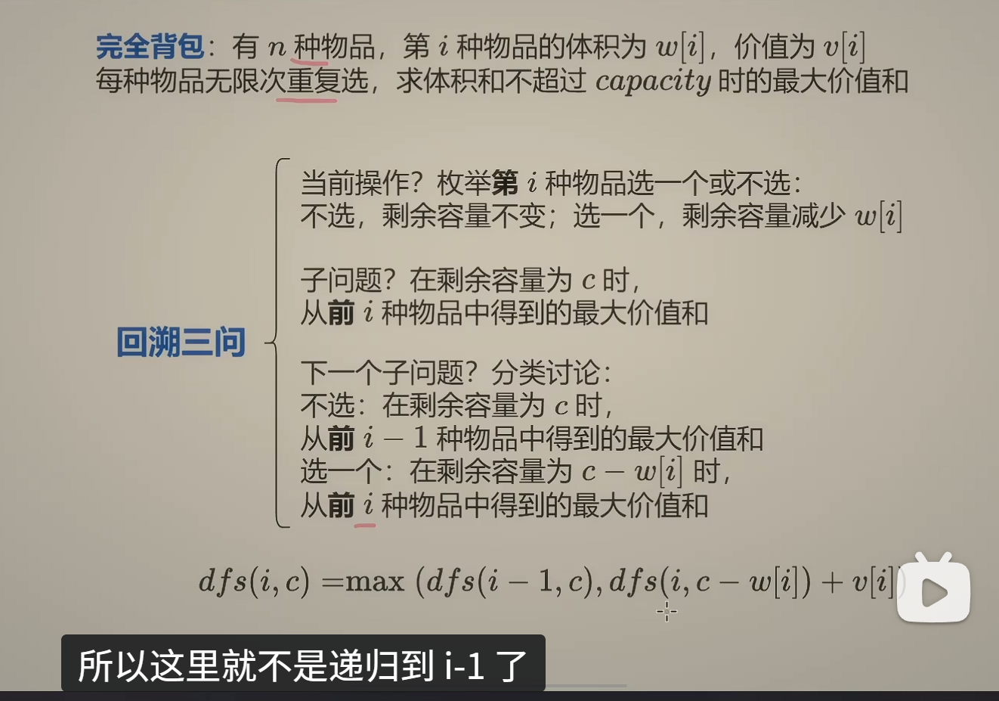

# 启发思路

类似于回溯算法，有“选和不选”或者“选哪个”两种思路。

# 萌新三步

1. 思考回溯怎么写？
   - 入参和返回值
   - 递归到哪里
   - 递归边界和入口
2. 改成记忆化搜索(自顶向下算)
   - 把递归的计算结果保存下来(cache数组或者哈希表)，那么下次递归到同样的入参时，就直接返回先前保存的结果。
   - 递归搜索 + 保存计算结果 = 记忆化搜索
3. 1:1 翻译成递推(自底向上算)
   - dfs -> f数组
   - 递归 -> 循环
   - 递归边界 -> 数组初始值

# 第I个操作和前I个操作

在定义DFS或者DB数组的含义时，dfs(i)只能表示**从一些元素中算出的结果**，而不是从一个元素中算出的结果。

# DP 分类

## 选或不选

- 0-1 背包
  - LC494 目标和
  - 回溯
  - 记忆化搜索
  - 递推
  - 空间优化：两个数组
  - 空间优化：一个数组
- 完全背包
  - LC322 零钱兑换
  - 同上
- 常见变形（变形解法看视频）
  - 至多装capacity，求方案数/最大价值和
  - 恰好装capacity，求方案数/最大/最小价值和
  - 至少装capacity，求方案数/最小价值和
- 0-1 背包 与 完全背包的区别
  - 0-1 背包是从N个物品里面选，选完就不能再选这个物品了。回溯时，选择一个物品以后，i要发生改变，表示不能再选了。递归时，就是 I-1。

    

  - 完全背包是从N种物品里面选，选完还能重复选。回溯时，在选择一个物品以后，I是不变的。表示可以继续选第I种物品。所以递归就不是递归到I-1，而是递归到I。

    

# 例题

## 198 - 打家劫舍

1. 考虑最后一个房子选还是不选。如果不选，那么问题就变成N-1个房子的问题。如果选，那么问题就变成N-2个房子的问题。
   也可以考虑第一个房子选还是不选，只不过倒着选，方便写边界条件。

### 回溯三问

1. 当前操作？枚举**第**i个房子选或不选
2. 子问题：从**前**i个房子中得到的最大金额和
3. 下一个子问题，分类讨论：
   不选：从**前**i-1个房子中得到的最大金额和
   选：从**前**i-2个房子中得到的最大金额和

`dfs(i) = max (dfs(i - 1), dfs(i - 2) + nums[i])`

dfs(i)就是从**前**i个房子中得到的最大金额和

### 记忆化搜索

1. `dfs(3) = max (dfs(2), dfs(1) + nums[3])`
2. `dfs(2) = max (dfs(1), dfs(0) + nums[2])`

可以看到，第一步中会计算 dfs(2)，第二步中又重复计算dfs(2)，所以可以将第一次计算的结果保存下来。

### 翻译成递推

1. `dfs(i) = max (dfs(i - 1), dfs(i - 2) + nums[i])`

dfs -> f数组

2. `f[i] = max (f[i - 1], f[i - 2] + nums[i])`

考虑递归边界

3. `f[i+2] = max (f[i + 1], f[i] + nums[i])`

## LC494 目标和

### 先看 0-1 背包问题

#### 定义

有n 个物品，第i 个物品的体积为 w[i]，价值为 v[i]。每个物品至多选一个，求体积和不超过capacity时的最大价值和

#### 回溯三问

1. 当前操作？枚举第i个物品选或不选： 不选，剩余容量不变；选，剩余容量减少w[i] -> 确定递归参数中的 i 和 c， 即 dfs(i, c)
2. 子问题？在剩余容量为c时，从前i个物品中得到的最大价值和
3. 下一个子问题？分类讨论：不选：在剩余容量为c时，从前i一1个物品中得到的最大价值和；选：在剩余容量为c—w[i]时，从前i一1个物品中得到的最大价值和

`dfs(i, c) = max (dfs(i - 1, c), dfs(i - 1, c - w[i]) + v[i])`
对应取不选和选的最大值

### 目标和

- p是正数的累计和
- s-p是nums的和减去正数和得到的负数和
- `p-(s-p)` 在nums中添加完正负号后应该等于target(t)，则 `p = (s+t)/2`
- 问题转化成从 nums 数组中选择一些数字，使得它们的和恰好等于 `(s+t)/2` 的 方案数

#### 回溯三问

1. 当前操作？枚举第i个数选或不选： 不选，剩余总和不变；选，剩余总和减少nums[i] -> 确定递归参数中的 i 和 c， 即 dfs(i, c)
2. 子问题？在剩余总和为c时，从前i个数中选择一些数字，使得它们的和恰好等于c的方案数
3. 下一个子问题？分类讨论：不选：在剩余总和为c时，从前i-1个数中选择一些数字，使得它们的和恰好等于c的方案数；选：在剩余总和为c—nums[i]时，从前i-1个数中选择一些数字，使得它们的和恰好等于c—nums[i]的方案数
4. 因为是求方案数，所以是两者相加

`dfs(i,c) = dfs(i - 1, c) + dfs(i - 1, c - nums[i]);`

## 322. 零钱兑换

完全背包的一种变形

### 思路：

1. 物品的价值看成1
   - 1 表示用了一个硬币。价值为1时，价值就等于数量。
   - w[i] 即硬币面值。v[i] 固定为1, 即硬币价值，等同于数量
2. 把01背包中的最大改为求最小
   - 求最小价值等同于求最少数量
3. 边界值
   - `return c === 0 ? 0 : Infinity`
   - 当剩余金额 c 为0时，不需要再继续增加硬币数，所以返回0
   - 当c=0的时候，方案数为1，当前所需硬币为0，看题目求什么，return就返回什么，其他值（inf，0等等）也是根据这个来定的

### 状态转移

`dfs(i, c) = min (dfs(i - 1, c), dfs(i, c - w[i]) + v[i])`
